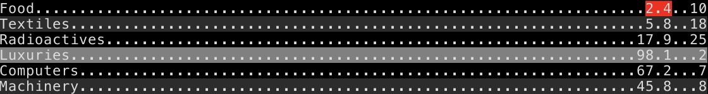

pytui extras
============

Additional TUI related things based on [pytui](https://github.com/smar10s/pytui) that I found useful in other projects.

### Install:
Either get `pytui_extra.py` and use module directly, or clone and install with pip, e.g.:

```
git clone https://github.com/smar10s/pytui_extra/
pip install pytui_extra/
```

### Use:

#### Table

A basic table that divides a window into columns using `Window.vsplit` and provides convenience methods for updating and formatting content.

The constructor expects a window to use, followed by an array of column sizes in the same format as `Window.vsplit`: integers are absolute characters, floats are ratios of window size, and `None` represents remaining space ('auto'). 

For example, given a window 10 characters wide:
- `[None, 4, 4]` will create 3 columns sized 2, 4, 4
- `[None, None]` will create 2 columns sized 5, 5
- `[4, 4]` will create 2 columns sized 4, 4 and ignore the remainder
- `[0.2, None, 1]` will create 3 columns sized 2, 7, 1

Data in columns is left justified using space as the padding character. This can be changed on a per-column level using `set_column_format`.

Rows are striped by default. Set `striped = False` to disable. To change colours and other style options, set `row_style` and `alt_row_style` to a `Text.style` dictionary.

Rows can be styled individually using `style_row`. This accepts a list of strings and a `Text.style` dictionary to apply. Values are also justified with the same style applied to the justify character.

`highlight_row` is a convenience method that uses `style_row` to apply a `highlight_style` background. This can be changed as above.

Example:

Create a table in a 40x10 window with three columns, a header and non-default row styles.

```
from pytui import Window, Text
from pytui_extra import Table


# create 40x10 window at top left
window = Window(0, 0, 40, 10)

# create a table with three columns: two 6 char wide on the right, with the remainder on the left
table = Table(
    window,
    [None, 6, 6],

    # include optional header
    header=['Items', 'Price', 'Count'],
    header_style={'bg': 0x232D51, 'fg': 0xA2AADD, 'bold': True},

    # change default styles
    row_style={'bg': 0x1B1E2D, 'fg': 0xA2AADD},
    alt_row_style={'bg': 0x181A28, 'fg': 0xA2AADD},
    highlight_style={'bg': 0x232D51, 'fg': 0xA2AADD},
)

# right-justify the right columns
table.set_column_format(1, {'justify': 'right'})
table.set_column_format(2, {'justify': 'right'})

# update table with data - slice operators are useful for 'paging'
table.update([
    ['Food', Text('2.4').style({'fg': 0xff0000}), 10],  # apply style to individual cell
    ['Textiles', 5.8, 18],
    ['Radioactives', 17.9, 25],
    table.highlight_row(['Luxuries', '98.1', '2']),         # highlight row
    ['Computers', 67.2, 7],
    ['Machinery', 45.8, 8],
])

# draw table
table.draw()
```



#### Input Prompt

This combines a keyboard with a window to create a text input prompt. The keyboard listens for input and echos it to the window, calling a handler on tab or enter. The window may be multiple lines and will scroll as necessary. The prompt (`# ` for example) and cursor may be customized and styled. The window may also be a StyledWindow.

The following example will prompt for input and exit if 'quit' was entered.


```
import signal
import os
from time import sleep
from pytui import Window, Keyboard, shutdown
from pytui_extra import InputPrompt


# ensure ctrl+c restores terminal state before messing with it
signal.signal(signal.SIGINT, lambda signal, frame: shutdown())


# handler quits on 'quit', ignores all other input
def on_enter(buffer: str, tokens: list[str]) -> None:
    if buffer == 'quit':
        os.kill(os.getpid(), signal.SIGINT)


# create new input prompt using 10x10 window that will scroll if necessary
prompt = InputPrompt(Window(0, 0, 10, 10), Keyboard(), on_enter)
prompt.listen()


# spin until quit
while True:
    sleep(1)
```
